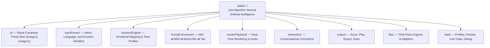

# JAMAI 🎸 — Just Algorithm Musical Artificial Intelligence

Welcome to JAMAI’s World!  
This is a living project where music, story, and code come alive together.

## What is JAMAI?
JAMAI listens to your voice or words, understands your feelings, and turns them into music you can see and hear.  
You can talk, type, or sing — JAMAI will help you make music, learn, and play!

## How to Start
1. Clone this repo (`git clone ...`)
2. Open the `ui/` folder to access the Ritual Composer Portal
3. Use the voice or text input to start creating music
4. Explore the modules to see how JAMAI works behind the scenes
5. Check the `data/` folder for emotion profiles and presets
6. Dive into the `libs/` folder to see third-party integrations like abcjs, music21, and more
7. Use the `renderPlayback/` module to hear your music in real-time
8. Save, export, and share your musical creations via the `output/` module
   
---

## Spiral Scaffold: JAMAI Core Structure

---

## JAMAI Module/Folder Commentary

- **ui/**: Ritual Composer Portal (see ), houses all web and voice UI logic; central for input, preview, play, export.
- **inputParser/**: Core for language, emotion, and symbolic command parsing. Connects voice/text to intent.
- **emotionEngine/**: Maps emotional cues to musical properties. The heart of JAMAI’s “structured feeling.”
- **formatConversion/**: Bridges all notation formats—ABC, MIDI, MusicXML, tablature—via adapters and music21.
- **renderPlayback/**: Handles real-time notation display, playback, and feedback (abcjs, MuseScore, MIDI).
- **interactive/**: Conversational loop—refine music, apply corrections, support session memory.
- **output/**: Renders scores, exports MIDI/WAV, supports save/share.
- **libs/**: Third-party library adapters—abcjs, music21, MuseScore, Magenta, RLJam, etc.
- **data/**: Stores emotion profiles, tone presets, and user session data for dynamic adaptation.

---

## Extension/Evolution Principles

- Every module should be extensible: add new instruments, emotion profiles, or renderers without breaking the core.
- Cross-linking: UI, emotion, and output modules talk via adapters (JamaiAdapter).
- Feedback loop: Correction and refinement is conversational, voice-aware, emotionally dynamic.
- Emotional annotation: All music generated should be tagged with intent and emotional context for transparency.

---

## UI/UX (See )

- **Left:** ABC Notation input, copy, simplify, vary, continue, show tab
- **Right:** Preview (score, instrument, BPM, emotional tag, play/export)
- **Voice:** Mic input, voice-to-text, conversational correction
- **Emotion:** Slider/switches for dynamic tone/emotion mapping

---

# Contributing

We welcome contributors of all backgrounds and skill levels! If you want to help build JAMAI, here’s how to get started:

- **Project Status:** The core architecture is being designed, but most features and modules are not yet implemented. This is a living, collaborative project—your ideas and code are needed!
- **How to Contribute:**
  1. **Fork this repository** and create a new branch for your changes.
  2. **Check the module folders** (see above) for README files and planned structure.
  3. **Open an issue** if you have questions, want to propose a feature, or need guidance.
  4. **Submit a pull request** with your improvements, bug fixes, or new modules.
- **Guidelines:**
  - Keep code modular and well-documented.
  - Add comments explaining your logic, especially for new features.
  - If you’re unsure where to start, ask in an issue or suggest improvements to documentation.

**Note:** Since the project is in its early stages, there are no strict contribution rules yet. All constructive input is appreciated!

Let’s build JAMAI together! 🎶

---
// Spiral Agent Protocol, G.Music: CONTRIBUTOR MODE
// (This section will evolve as the project grows)
// ...existing code...
