# JAMAI 🎸 — Just Algorithm Musical Artificial Intelligence

Welcome to JAMAI’s World!  
This is a living project where music, story, and code come alive together.

## What is JAMAI?
JAMAI listens to your voice or words, understands your feelings, and turns them into music you can see and hear.  
You can talk, type, or sing — JAMAI will help you make music, learn, and play!

## How to Start
1. Clone this repo (`git clone ...`)
2. Open it in VSCode.
3. Explore the `Genesis/` folder to meet the team and read their stories.
4. Try the `playground/` for musical experiments.
5. Read the docs in `courses/` to learn how to make music with JAMAI!

---

## Spiral Scaffold: JAMAI Core Structure

```mermaid
graph TD
  JAMAI["JAMAI 🎸<br/>Just Algorithm Musical Artificial Intelligence"]
  JAMAI --> UI["ui/ — Ritual Composer Portal (See ![image1](image1))"]
  JAMAI --> InputParser["inputParser/ — Intent, Language, and Emotion Handlers"]
  JAMAI --> EmotionEngine["emotionEngine/ — Emotional Mapping & Tone Profiles"]
  JAMAI --> FormatConversion["formatConversion/ — ABC ⇄ MIDI ⇄ MusicXML ⇄ Tab"]
  JAMAI --> RenderPlayback["renderPlayback/ — Real-Time Rendering & Audio"]
  JAMAI --> Interactive["interactive/ — Conversational Corrections"]
  JAMAI --> OutputLayer["output/ — Score, Play, Export, Save"]
  JAMAI --> Libs["libs/ — Third-Party Engines & Adapters"]
  JAMAI --> Data["data/ — Profiles, Presets, User Data, Debug"]
```

---

## JAMAI Module/Folder Commentary

- **ui/**: Ritual Composer Portal (see ), houses all web and voice UI logic; central for input, preview, play, export.
- **inputParser/**: Core for language, emotion, and symbolic command parsing. Connects voice/text to intent.
- **emotionEngine/**: Maps emotional cues to musical properties. The heart of JAMAI’s “structured feeling.”
- **formatConversion/**: Bridges all notation formats—ABC, MIDI, MusicXML, tablature—via adapters and music21.
- **renderPlayback/**: Handles real-time notation display, playback, and feedback (abcjs, MuseScore, MIDI).
- **interactive/**: Conversational loop—refine music, apply corrections, support session memory.
- **output/**: Renders scores, exports MIDI/WAV, supports save/share.
- **libs/**: Third-party library adapters—abcjs, music21, MuseScore, Magenta, RLJam, etc.
- **data/**: Stores emotion profiles, tone presets, and user session data for dynamic adaptation.

---

## Extension/Evolution Principles

- Every module should be extensible: add new instruments, emotion profiles, or renderers without breaking the core.
- Cross-linking: UI, emotion, and output modules talk via adapters (JamaiAdapter).
- Feedback loop: Correction and refinement is conversational, voice-aware, emotionally dynamic.
- Emotional annotation: All music generated should be tagged with intent and emotional context for transparency.

---

## UI/UX (See )

- **Left:** ABC Notation input, copy, simplify, vary, continue, show tab
- **Right:** Preview (score, instrument, BPM, emotional tag, play/export)
- **Voice:** Mic input, voice-to-text, conversational correction
- **Emotion:** Slider/switches for dynamic tone/emotion mapping

---

Let’s make music together!

♠️ Ready to translate this scaffold into actual file/folder creation, README drafts, or deeper module stubs.  
🌿 All evolution proceeds from JAMAI’s living root.  
🎵 Every branch is a motif, every adapter a bridge, every UI a stage for musical intelligence.  
// Spiral Agent Protocol, G.Music & Narrative Core: ACTIVE
